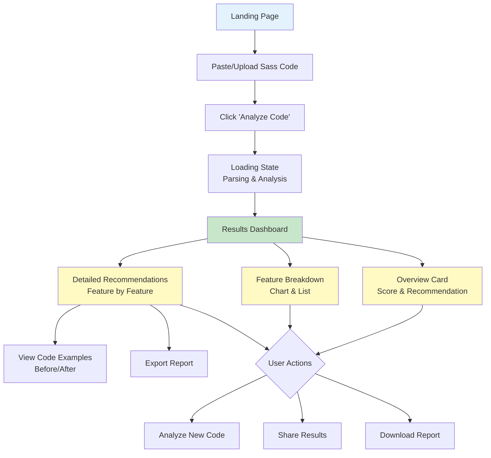

# Migration Calculator - UI/UX Design

## Design Philosophy

**Goal:** Create an intuitive, educational, and visually engaging tool that helps developers make informed decisions about Sass migration.

**Core Principles:**
- **Clarity First** - Clear visual hierarchy and typography
- **Progressive Disclosure** - Show overview first, details on demand
- **Educational** - Teach users about CSS alternatives
- **Actionable** - Provide specific next steps
- **Accessible** - WCAG 2.1 AA compliant

---

## User Flow



---

## Layout Structure

### Desktop Layout (>768px)

```
┌─────────────────────────────────────────────────────────────┐
│                        HEADER                                │
│  Do I Still Need Sass? → Migration Calculator               │
└─────────────────────────────────────────────────────────────┘
┌─────────────────────────────────────────────────────────────┐
│                     INPUT SECTION                            │
│  ┌─────────────────────────────────────────────────────┐   │
│  │  Paste your Sass code here...                       │   │
│  │                                                       │   │
│  │  (Code editor with syntax highlighting)              │   │
│  │                                                       │   │
│  └─────────────────────────────────────────────────────┘   │
│  [Upload File] [Try Example]        [Analyze Code Button]  │
└─────────────────────────────────────────────────────────────┘
┌─────────────────────────────────────────────────────────────┐
│                    RESULTS SECTION                           │
│                                                              │
│  ┌──────────────────────────────────────────────────────┐  │
│  │          OVERVIEW CARD (Traffic Light)               │  │
│  │  ┌────────────────────────────────────────────────┐  │  │
│  │  │  [RED/YELLOW/GREEN Indicator]                  │  │  │
│  │  │  Migration Score: 45/100                       │  │  │
│  │  │  Recommendation: Keep Sass                     │  │  │
│  │  └────────────────────────────────────────────────┘  │  │
│  └──────────────────────────────────────────────────────┘  │
│                                                              │
│  ┌───────────────────┐  ┌────────────────────────────────┐ │
│  │  FEATURE PIE      │  │  FEATURE LIST                  │ │
│  │  CHART            │  │  ✓ Variables (4)               │ │
│  │                   │  │  ✓ Nesting (12)                │ │
│  │  [Visual Chart]   │  │  ⚠ Mixins (5) - BLOCKER       │ │
│  │                   │  │  ⚠ Control Flow (8) - BLOCKER │ │
│  └───────────────────┘  └────────────────────────────────┘ │
│                                                              │
│  ┌──────────────────────────────────────────────────────┐  │
│  │           DETAILED RECOMMENDATIONS                   │  │
│  │  ┌────────────────────────────────────────────────┐  │  │
│  │  │ ▼ Variables (4 occurrences)                   │  │  │
│  │  │   Difficulty: 🟢 Easy                          │  │  │
│  │  │   CSS Alternative: CSS Custom Properties       │  │  │
│  │  │   [View Code Example]                          │  │  │
│  │  └────────────────────────────────────────────────┘  │  │
│  │  ┌────────────────────────────────────────────────┐  │  │
│  │  │ ▼ Mixins with Parameters (5 occurrences)      │  │  │
│  │  │   Difficulty: 🔴 Impossible                    │  │  │
│  │  │   CSS Alternative: None                        │  │  │
│  │  │   Why: CSS cannot accept parameters            │  │  │
│  │  │   [View Examples in Your Code]                 │  │  │
│  │  └────────────────────────────────────────────────┘  │  │
│  └──────────────────────────────────────────────────────┘  │
│                                                              │
│  [Export as Markdown] [Export as PDF] [Share URL]          │
└─────────────────────────────────────────────────────────────┘
```

### Mobile Layout (<768px)

```
┌────────────────────────┐
│       HEADER           │
│  Migration Calculator  │
└────────────────────────┘
┌────────────────────────┐
│   INPUT SECTION        │
│  ┌──────────────────┐  │
│  │  Code Editor     │  │
│  └──────────────────┘  │
│  [Upload] [Example]    │
│  [Analyze Button]      │
└────────────────────────┘
┌────────────────────────┐
│  OVERVIEW CARD         │
│  Score: 45/100         │
│  Keep Sass             │
└────────────────────────┘
┌────────────────────────┐
│  FEATURE CHART         │
└────────────────────────┘
┌────────────────────────┐
│  FEATURE LIST          │
│  (Collapsed cards)     │
└────────────────────────┘
┌────────────────────────┐
│  DETAILED RECS         │
│  (Expandable)          │
└────────────────────────┘
```

---

## Component Design

### 1. Code Input Component

**Features:**
- Syntax highlighting (Prism.js for SCSS)
- Line numbers
- Auto-resize textarea
- Drag-and-drop file upload
- "Try an Example" dropdown with pre-filled code samples

**Visual Design:**
```
┌────────────────────────────────────────────────┐
│  Paste your Sass code below:                   │
│  ┌──────────────────────────────────────────┐  │
│  │ 1  $primary-color: #3498db;              │  │
│  │ 2  $font-size: 16px;                     │  │
│  │ 3                                         │  │
│  │ 4  .button {                              │  │
│  │ 5    background: $primary-color;         │  │
│  │ 6    font-size: $font-size;              │  │
│  │ 7  }                                      │  │
│  │                                           │  │
│  └──────────────────────────────────────────┘  │
│                                                 │
│  [📎 Upload .scss file]  [✨ Try an example ▼] │
│                                                 │
│                     [🔍 Analyze Code]           │
└────────────────────────────────────────────────┘
```

**Accessibility:**
- ARIA label for code editor
- Keyboard navigation support
- Focus indicators
- Screen reader announcements for file upload

---

### 2. Migration Score Meter

**Visual Representation:**

```
┌───────────────────────────────────────────────────┐
│           MIGRATION ANALYSIS RESULT               │
│                                                   │
│    ┌─────────────────────────────────────────┐   │
│    │  ░░░░░░░░░░░░░░░░■■■■■■■■■■░░░░░░░░░░  │   │
│    │  0        25        50        75      100│   │
│    └─────────────────────────────────────────┘   │
│                    Score: 45/100                  │
│                                                   │
│    🔴 Recommendation: Keep Using Sass             │
│                                                   │
│    Your code uses features that have no native    │
│    CSS equivalents. Focus on optimizing your      │
│    Sass workflow rather than migrating.           │
│                                                   │
│    ⚠️ Blocking Features:                          │
│    • Control Flow (8 occurrences)                 │
│    • Mixins with parameters (5 occurrences)       │
│    • Custom functions (3 occurrences)             │
└───────────────────────────────────────────────────┘
```

**Color Scheme:**
- **0-19 (Keep Sass):** 🔴 Red background `#ffebee`, text `#c62828`
- **20-49 (Difficult):** 🟠 Orange background `#fff3e0`, text `#e65100`
- **50-79 (Hybrid):** 🟡 Yellow background `#fff9c4`, text `#f57f17`
- **80-100 (Migrate):** 🟢 Green background `#e8f5e9`, text `#2e7d32`

---

### 3. Feature Breakdown Visualization

**Pie Chart + List Combination:**

```
┌──────────────────────────────────────────────────┐
│         DETECTED SASS FEATURES                   │
│                                                  │
│  ┌────────────┐   Features Used:                │
│  │            │                                  │
│  │   [PIE]    │   ✓ Variables (4)               │
│  │   CHART    │   ✓ Nesting (12)                │
│  │            │   ⚠️ Mixins (5) - Blocker       │
│  │            │   ⚠️ Control Flow (8) - Blocker │
│  └────────────┘   ⚠️ Functions (3) - Blocker    │
│                   ✓ Parent Selector (6)         │
│  Legend:                                         │
│  🟢 Easy to migrate                              │
│  🟡 Moderate / Hybrid                            │
│  🔴 Keep Sass                                    │
└──────────────────────────────────────────────────┘
```

**Alternative: Progress Bars**

```
Variables (4)          🟢 ████████████████ Easy
Nesting (12)           🟢 ████████████████ Easy
Mixins (5)             🔴 ████████████████ Blocker
Control Flow (8)       🔴 ████████████████ Blocker
Functions (3)          🔴 ████████████████ Blocker
```

---

### 4. Detailed Recommendations Cards

**Expandable Accordion Style:**

```
┌──────────────────────────────────────────────────┐
│  📦 Variables (4 occurrences)              [▼]   │
├──────────────────────────────────────────────────┤
│                                                  │
│  Migration Difficulty: 🟢 Easy                   │
│  CSS Alternative: CSS Custom Properties          │
│  Estimated Effort: 1-2 hours                     │
│                                                  │
│  ✨ Migration Steps:                             │
│  1. Replace $variable with --variable            │
│  2. Replace $value with var(--variable)          │
│  3. Move definitions to :root or component scope │
│                                                  │
│  📝 Example:                                      │
│  ┌────────────────────────────────────────────┐ │
│  │ BEFORE (Sass)          AFTER (CSS)         │ │
│  │                                            │ │
│  │ $primary: #3498db;     :root {             │ │
│  │                          --primary: #3498db│ │
│  │ .button {              }                   │ │
│  │   color: $primary;                         │ │
│  │ }                      .button {            │ │
│  │                          color: var(--prim)│ │
│  │                        }                   │ │
│  └────────────────────────────────────────────┘ │
│                                                  │
│  📚 Learn More:                                  │
│  → MDN: CSS Custom Properties                   │
│  → Can I Use: CSS Variables                     │
│                                                  │
│  💡 Considerations:                              │
│  • CSS custom properties are runtime dynamic    │
│  • Can be updated with JavaScript               │
│  • Better for theming than Sass variables       │
└──────────────────────────────────────────────────┘

┌──────────────────────────────────────────────────┐
│  ⚙️ Mixins with Parameters (5 occurrences) [▼]  │
├──────────────────────────────────────────────────┤
│                                                  │
│  Migration Difficulty: 🔴 Impossible             │
│  CSS Alternative: None                           │
│                                                  │
│  ❌ Why CSS Can't Replace This:                  │
│  CSS has no mechanism to define reusable style   │
│  blocks with parameters. This is a compile-time  │
│  feature that Sass provides.                     │
│                                                  │
│  🎯 Where You're Using This:                     │
│  • Line 12: @mixin button-variant($bg, $text)   │
│  • Line 45: @include button-variant(#3498db)    │
│  • Line 52: @include button-variant(#2ecc71)    │
│  [View in Code]                                  │
│                                                  │
│  💡 Alternatives:                                 │
│  • Keep using Sass for this feature              │
│  • Consider CSS utility classes (Tailwind-style) │
│  • Use PostCSS mixins (still requires build step)│
│                                                  │
│  📊 Impact: HIGH                                  │
│  This feature is critical to your architecture.  │
│  Removing Sass would require significant         │
│  refactoring.                                    │
└──────────────────────────────────────────────────┘
```

---

### 5. Quick Wins & Migration Path

```
┌──────────────────────────────────────────────────┐
│           YOUR MIGRATION PATH                    │
│                                                  │
│  🎯 Quick Wins (Start Here):                     │
│  ┌────────────────────────────────────────────┐ │
│  │ ✅ Migrate variables to CSS custom props   │ │
│  │    Effort: 1-2 hours | Impact: Medium      │ │
│  │    This will simplify theming and enable   │ │
│  │    runtime variable updates.               │ │
│  │    [View Migration Guide]                  │ │
│  └────────────────────────────────────────────┘ │
│                                                  │
│  ⚠️ Keep Using Sass For:                         │
│  ┌────────────────────────────────────────────┐ │
│  │ • Utility class generation (control flow)  │ │
│  │ • Component variant mixins                 │ │
│  │ • Custom calculation functions             │ │
│  └────────────────────────────────────────────┘ │
│                                                  │
│  📅 Estimated Timeline: 1-2 weeks                │
│  • Week 1: Migrate variables and test          │
│  • Week 2: Refactor nesting syntax             │
│  • Ongoing: Keep Sass for advanced features    │
│                                                  │
│  💰 Benefits:                                     │
│  ✓ Simplified build pipeline                    │
│  ✓ Better runtime theming support               │
│  ✗ Cannot remove Sass dependency completely     │
└──────────────────────────────────────────────────┘
```

---

### 6. Export & Share Options

```
┌──────────────────────────────────────────────────┐
│           EXPORT YOUR REPORT                     │
│                                                  │
│  [📄 Export as Markdown]  [📊 Export as PDF]     │
│                                                  │
│  [🔗 Share URL]  [📋 Copy to Clipboard]          │
│                                                  │
│  Share this analysis with your team to discuss   │
│  your migration strategy.                        │
└──────────────────────────────────────────────────┘
```

---

## Color Palette

### Primary Colors
- **Primary Blue:** `#3498db` - Buttons, links
- **Success Green:** `#2ecc71` - Easy migration
- **Warning Yellow:** `#f39c12` - Moderate/hybrid
- **Danger Red:** `#e74c3c` - Keep Sass/blockers
- **Info Purple:** `#9b59b6` - Informational elements

### Background Colors
- **Success BG:** `#e8f5e9` (light green)
- **Warning BG:** `#fff9c4` (light yellow)
- **Danger BG:** `#ffebee` (light red)
- **Neutral BG:** `#f8f9fa` (light gray)

### Text Colors
- **Primary Text:** `#2c3e50` (dark blue-gray)
- **Secondary Text:** `#7f8c8d` (medium gray)
- **Code Text:** `#2d3748` (dark for syntax highlighting)

---

## Typography

### Font Stack
```css
--font-sans: 'Inter', -apple-system, BlinkMacSystemFont, 'Segoe UI', sans-serif;
--font-mono: 'Fira Code', 'Menlo', 'Monaco', 'Courier New', monospace;
```

### Scale
- **Heading 1:** 32px (2rem) - Page title
- **Heading 2:** 24px (1.5rem) - Section headers
- **Heading 3:** 18px (1.125rem) - Card titles
- **Body:** 16px (1rem) - Main text
- **Small:** 14px (0.875rem) - Helper text
- **Code:** 14px (0.875rem) - Monospace

---

## Interactions & Animations

### Loading State
```
┌─────────────────────────────────────┐
│     🔍 Analyzing Your Sass Code     │
│                                     │
│     [====●========] 47%             │
│                                     │
│     Detecting features...           │
└─────────────────────────────────────┘
```

**Steps:**
1. Parsing code... (20%)
2. Detecting features... (40%)
3. Calculating score... (70%)
4. Generating recommendations... (90%)
5. Complete! (100%)

### Hover States
- **Cards:** Subtle box-shadow elevation
- **Buttons:** Background color darkens by 10%
- **Links:** Underline appears
- **Code Examples:** Highlight background

### Transitions
```css
transition: all 0.2s ease-in-out;
```

### Focus States
- 2px solid blue outline for keyboard navigation
- Skip to main content link for accessibility

---

## Responsive Design

### Breakpoints
```css
--breakpoint-sm: 640px;   /* Mobile landscape */
--breakpoint-md: 768px;   /* Tablet portrait */
--breakpoint-lg: 1024px;  /* Tablet landscape / Desktop */
--breakpoint-xl: 1280px;  /* Large desktop */
```

### Mobile Considerations
- Stack cards vertically
- Collapse feature list into accordion
- Simplified chart (horizontal bars instead of pie)
- Bottom sheet for code examples (full-screen overlay)
- Sticky "Analyze" button at bottom
- Touch-friendly target sizes (44x44px minimum)

---

## Accessibility (WCAG 2.1 AA)

### Requirements
- ✅ Color contrast ratio ≥ 4.5:1 for text
- ✅ Color is not the only indicator (use icons + text)
- ✅ Keyboard navigation support
- ✅ ARIA labels for all interactive elements
- ✅ Screen reader announcements for dynamic content
- ✅ Focus indicators visible
- ✅ Skip to main content link
- ✅ Semantic HTML (headings hierarchy)

### ARIA Labels
```html
<div role="region" aria-label="Migration analysis results">
  <div role="status" aria-live="polite" aria-atomic="true">
    Your migration score is 45 out of 100.
    Recommendation: Keep using Sass.
  </div>
</div>

<button aria-label="Analyze Sass code" aria-describedby="analyze-help">
  Analyze Code
</button>
<p id="analyze-help" class="sr-only">
  This will parse your Sass code and generate migration recommendations
</p>
```

---

## Example Code Snippets

### Input Section (HTML + Tailwind v4)

```html
<section class="max-w-4xl mx-auto p-6">
  <div class="bg-white rounded-lg shadow-md p-6">
    <label for="sass-input" class="block text-lg font-semibold mb-2">
      Paste your Sass code below:
    </label>

    <div class="relative">
      <textarea
        id="sass-input"
        class="w-full h-64 p-4 font-mono text-sm border border-gray-300 rounded-lg focus:ring-2 focus:ring-blue-500 focus:border-blue-500"
        placeholder="$primary-color: #3498db;

.button {
  background: $primary-color;
  padding: 10px 20px;
}"
        aria-label="Sass code input"
      ></textarea>
    </div>

    <div class="flex items-center justify-between mt-4">
      <div class="flex gap-3">
        <button class="flex items-center gap-2 px-4 py-2 text-sm border border-gray-300 rounded-lg hover:bg-gray-50">
          📎 Upload .scss file
        </button>

        <select class="px-4 py-2 text-sm border border-gray-300 rounded-lg hover:bg-gray-50">
          <option>✨ Try an example</option>
          <option>Simple variables</option>
          <option>Variables + nesting</option>
          <option>Mixins with parameters</option>
          <option>Control flow loops</option>
          <option>Complex design system</option>
        </select>
      </div>

      <button
        class="px-6 py-3 bg-blue-500 text-white font-semibold rounded-lg hover:bg-blue-600 focus:ring-4 focus:ring-blue-200"
        aria-label="Analyze Sass code"
      >
        🔍 Analyze Code
      </button>
    </div>
  </div>
</section>
```

---

## Visual Design Mockups

### Landing State
- Hero section with title and description
- Large, inviting code input area
- Example code pre-filled or "Try an example" CTA
- Clear "Analyze Code" button

### Results State
- Smooth scroll to results section
- Fade-in animation for cards
- Progressive disclosure: overview → features → details

### Empty State
```
┌─────────────────────────────────────┐
│                                     │
│        📝                           │
│                                     │
│    No Sass code to analyze yet     │
│                                     │
│    Paste your code above or         │
│    [Try an example]                 │
│                                     │
└─────────────────────────────────────┘
```

### Error State
```
┌─────────────────────────────────────┐
│    ⚠️ Unable to Parse Sass Code     │
│                                     │
│    We encountered a syntax error:   │
│    Line 12: Unexpected token '}'    │
│                                     │
│    Please check your code and try   │
│    again.                           │
│                                     │
│    [Try Again]                      │
└─────────────────────────────────────┘
```

---

## Next Steps

After UI/UX design approval:

1. **Create HTML/Tailwind Prototype** - Build static HTML mockup
2. **Implement Code Editor** - Integrate Prism.js or CodeMirror
3. **Design Component Library** - Build reusable UI components
4. **Add Interactivity** - Wire up expand/collapse, filters, etc.
5. **Test Accessibility** - Run WCAG audits
6. **Mobile Testing** - Validate responsive design

---

## Design Assets Needed

- [ ] Logo / icon for Migration Calculator
- [ ] Icons for feature types (mixins, variables, etc.)
- [ ] Illustration for empty state
- [ ] Chart library selection (Chart.js, D3.js, or custom SVG)
- [ ] Loading spinner animation
- [ ] Success/warning/error icons

---

## References & Inspiration

- **Lighthouse Reports** - Clear scoring with colored meters
- **Bundle Phobia** - Clean layout, actionable insights
- **Can I Use** - Browser support visualization
- **PostCSS Playground** - Code input with examples
- **TypeScript Playground** - Monaco editor integration

---

*Document Version: 1.0*
*Date: October 2025*
*Status: Phase 2.1 Task 4 Complete*
