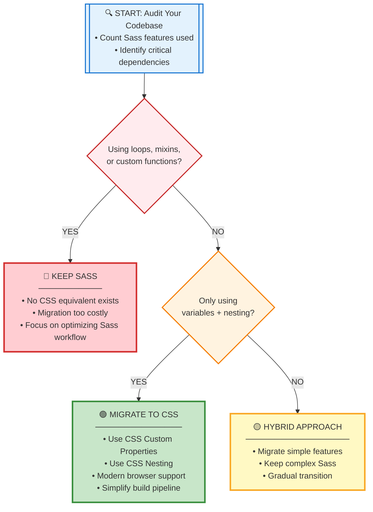
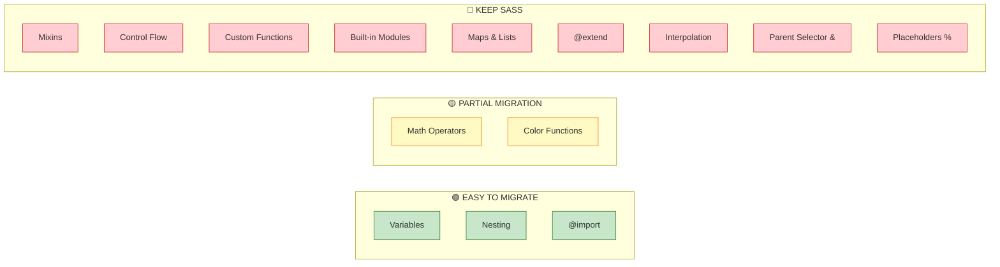
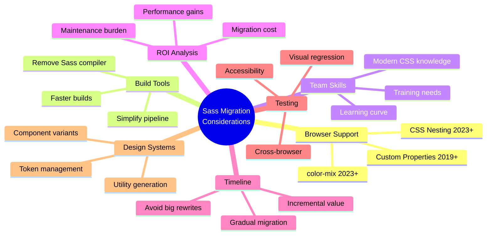

# Sass Migration Research & Analysis

Comprehensive research findings to support the Migration Calculator implementation

## Executive Summary

**Key Finding:** As of 2025, CSS has achieved native support for many Sass features (variables, nesting, @import), but Sass remains essential for projects using advanced features like mixins, control flow, and built-in modules.

**Migration Recommendation:** Teams should pursue a **hybrid approach** - migrate simple features to native CSS while retaining Sass for complex programmatic styling needs, especially in design systems and component libraries.

---

## Research Methodology

This research was conducted through:

1. **Codebase Analysis** - Reviewed all 14 Sass features tracked in `src/feature-data.js`
2. **Playground Testing** - Tested Sass features in the official Sass playground (v1.93.2)
3. **Browser Support Analysis** - Evaluated web-features data for CSS alternatives
4. **Migration Framework Design** - Created decision tree visualizations (see Mermaid diagrams below)

---

## Feature Analysis: Complete Breakdown

### 🟢 Tier 1: MIGRATE TO CSS (3 features - 21%)

Native CSS equivalents are widely available

#### 1. Variables

- **Sass Feature:** `$variable-name: value;`
- **CSS Alternative:** CSS Custom Properties `--variable-name: value;`
- **Browser Support:** ✅ Widely available since 2019 (Baseline: High)
- **Migration Difficulty:** 🟢 EASY
- **Key Difference:** CSS custom properties are runtime-dynamic, Sass variables are compile-time static
- **When to Migrate:** Almost always - CSS custom properties offer more flexibility
- **Example:**

  ```scss
  // SASS
  $primary-color: #3498db;
  .button { background: $primary-color; }

  // CSS
  :root { --primary-color: #3498db; }
  .button { background: var(--primary-color); }
  ```

#### 2. Nesting

- **Sass Feature:** Nested selector syntax
- **CSS Alternative:** CSS Nesting Module
- **Browser Support:** ✅ Newly available (2023) - Baseline: Low, widely supported in modern browsers
- **Migration Difficulty:** 🟢 EASY
- **Key Difference:** CSS nesting requires `&` for some cases where Sass doesn't
- **When to Migrate:** For new projects targeting modern browsers (2023+)
- **Example:**

  ```scss
  // SASS
  .card {
    padding: 20px;
    h2 { font-size: 24px; }
    &:hover { box-shadow: 0 4px 8px rgba(0,0,0,0.2); }
  }

  // CSS (requires & for element selectors)
  .card {
    padding: 20px;
    & h2 { font-size: 24px; }
    &:hover { box-shadow: 0 4px 8px rgba(0,0,0,0.2); }
  }
  ```

#### 3. Partials & @import

- **Sass Feature:** `@import 'partial';`
- **CSS Alternative:** `@import url('file.css');`
- **Browser Support:** ✅ Widely available since 2018
- **Migration Difficulty:** 🟡 MODERATE (Sass has better module system)
- **Key Difference:** CSS @import is runtime (slower), Sass @import is build-time
- **When to Migrate:** For simple CSS file organization; keep Sass for complex module systems
- **Recommendation:** Consider CSS @layer for better cascade control

---

### 🟡 Tier 2: PARTIAL MIGRATION (2 features - 14%)

CSS has alternatives but with limitations

#### 4. Math Operators

- **Sass Feature:** `+, -, *, /, %` operators work directly on variables
- **CSS Alternative:** `calc()` function
- **Browser Support:** ✅ Widely available since 2018
- **Migration Difficulty:** 🟡 MODERATE
- **Key Differences:**
  - Sass: Compile-time calculation, works on any values
  - CSS: Runtime calculation, requires calc() wrapper
  - Sass has comparison operators (`<`, `>`, `==`) - CSS doesn't
- **When to Migrate:** Simple arithmetic can use calc(); complex calculations need Sass
- **Example:**

  ```scss
  // SASS - compile time
  $base: 16px;
  .container {
    width: $base * 20;        // Direct calculation
    padding: $base / 2;
    @if $base > 10px { ... }  // Comparison - NO CSS EQUIVALENT
  }

  // CSS - runtime
  :root { --base: 16px; }
  .container {
    width: calc(var(--base) * 20);
    padding: calc(var(--base) / 2);
    /* No comparison operators in CSS */
  }
  ```

#### 5. Color Functions

- **Sass Feature:** `darken()`, `lighten()`, `saturate()`, `transparentize()`, etc.
- **CSS Alternative:** `color-mix()`, relative color syntax
- **Browser Support:** 🟡 color-mix() widely available (2023), relative colors newer
- **Migration Difficulty:** 🟡 MODERATE
- **Key Differences:**
  - Sass: Extensive color manipulation library
  - CSS: Limited but growing color functions
  - Different syntax and mental models
- **When to Migrate:** Simple color adjustments can use CSS; complex color systems need Sass
- **Example:**

  ```scss
  // SASS
  @use "sass:color";
  $base: #3498db;
  .button {
    background: $base;
    &:hover { background: color.scale($base, $lightness: 20%); }
  }

  // CSS
  :root { --base: #3498db; }
  .button {
    background: var(--base);
    &:hover { background: color-mix(in srgb, var(--base), white 20%); }
  }
  ```

---

### 🔴 Tier 3: KEEP SASS (9 features - 64%)

No CSS equivalents - Sass is essential for these

#### 6. Mixins

- **Sass Feature:** `@mixin` and `@include` for reusable style blocks with parameters
- **CSS Alternative:** ❌ None
- **Migration Difficulty:** 🔴 IMPOSSIBLE
- **Why Sass Wins:** CSS cannot define reusable style blocks with arguments
- **Use Cases:**
  - Component variants
  - Responsive breakpoint helpers
  - Design system utilities
  - Cross-browser prefixes (though autoprefixer is better)
- **Example (NO CSS EQUIVALENT):**

  ```scss
  @mixin button-style($bg, $text, $size: medium) {
    background: $bg;
    color: $text;
    padding: if($size == large, 20px 40px, 10px 20px);
    border-radius: 4px;
  }

  .primary-btn { @include button-style(#3498db, white); }
  .large-btn { @include button-style(#2ecc71, white, large); }
  ```

#### 7. Control Flow (@if, @for, @each, @while)

- **Sass Feature:** Programmatic CSS generation
- **CSS Alternative:** ❌ None
- **Migration Difficulty:** 🔴 IMPOSSIBLE
- **Why Sass Wins:** CSS is declarative, not programmatic
- **Critical Use Cases:**
  - Generating utility classes (spacing, colors, typography scales)
  - Design tokens system
  - Responsive grid systems
  - Theme variants
- **Example (NO CSS EQUIVALENT):**

  ```scss
  // Generate spacing utilities
  $spacing-base: 8px;
  @for $i from 1 through 8 {
    .m-#{$i} { margin: $spacing-base * $i; }
    .p-#{$i} { padding: $spacing-base * $i; }
  }
  // Output: .m-1 { margin: 8px; } ... .m-8 { margin: 64px; }

  // Generate color variants
  $colors: (primary: #3498db, success: #2ecc71, danger: #e74c3c);
  @each $name, $color in $colors {
    .bg-#{$name} { background: $color; }
    .text-#{$name} { color: $color; }
  }
  ```

#### 8. Built-in Modules

- **Sass Feature:** `sass:math`, `sass:color`, `sass:list`, `sass:map`, `sass:string`
- **CSS Alternative:** ❌ None (partial with native functions)
- **Migration Difficulty:** 🔴 IMPOSSIBLE
- **Why Sass Wins:** Comprehensive standard library for complex operations
- **Key Modules:**
  - **sass:math** - `ceil()`, `floor()`, `round()`, `min()`, `max()`, `abs()`, `pow()`
  - **sass:color** - `scale()`, `adjust()`, `mix()`, `invert()`, `complement()`
  - **sass:list** - `nth()`, `append()`, `join()`, `length()`, `index()`
  - **sass:map** - `get()`, `merge()`, `has-key()`, `keys()`, `values()`
  - **sass:string** - `quote()`, `unquote()`, `to-upper-case()`, `slice()`
- **Example:**

  ```scss
  @use "sass:math";
  @use "sass:list";

  $sizes: 10px, 20px, 30px;
  .element {
    width: math.div(960px, 12);              // 80px
    padding: list.nth($sizes, 2);             // 20px
    height: math.clamp(100px, 50vh, 500px);
  }
  ```

#### 9. Custom Functions (@function)

- **Sass Feature:** User-defined functions with return values
- **CSS Alternative:** ❌ None
- **Migration Difficulty:** 🔴 IMPOSSIBLE
- **Why Sass Wins:** Encapsulate complex calculations and logic
- **Example:**

  ```scss
  @function px-to-rem($px, $base: 16px) {
    @return math.div($px, $base) * 1rem;
  }

  @function contrast-color($bg) {
    @if lightness($bg) > 50% {
      @return #000;
    } @else {
      @return #fff;
    }
  }

  .card {
    font-size: px-to-rem(18px);  // 1.125rem
    color: contrast-color(#3498db);
  }
  ```

#### 10. Value Types (Maps & Lists)

- **Sass Feature:** Complex data structures
- **CSS Alternative:** ❌ None
- **Migration Difficulty:** 🔴 IMPOSSIBLE
- **Why Sass Wins:** Enable design token systems and configuration-driven styles
- **Example:**

  ```scss
  $theme: (
    colors: (
      primary: #3498db,
      secondary: #2ecc71
    ),
    spacing: 8px 16px 24px 32px,
    breakpoints: (sm: 640px, md: 768px, lg: 1024px)
  );

  .button {
    background: map.get($theme, colors, primary);
    padding: list.nth(map.get($theme, spacing), 2);
  }
  ```

#### 11. @extend

- **Sass Feature:** Selector inheritance
- **CSS Alternative:** ❌ None (use utility classes)
- **Migration Difficulty:** 🟡 MODERATE (can refactor to use classes)
- **Why Sass Wins:** DRY styles without HTML changes
- **When to Migrate:** Refactor to use utility classes in HTML instead
- **Example:**

  ```scss
  %button-base {
    padding: 10px 20px;
    border-radius: 4px;
  }

  .primary-btn {
    @extend %button-base;
    background: blue;
  }

  // CSS Alternative: Use multiple classes
  // <button class="button-base primary-btn">
  ```

#### 12. Interpolation (#{})

- **Sass Feature:** Embed expressions in selectors, property names, strings
- **CSS Alternative:** ❌ None
- **Migration Difficulty:** 🔴 IMPOSSIBLE
- **Why Sass Wins:** Dynamic selector/property generation
- **Example:**

  ```scss
  $direction: top;
  $prefix: btn;

  .#{$prefix}-primary {           // .btn-primary
    border-#{$direction}: 2px;    // border-top: 2px;
  }
  ```

#### 13. Parent Selector (&) - Advanced Usage

- **Sass Feature:** `&` for complex selector manipulation
- **CSS Alternative:** 🟡 Basic `&` in CSS nesting, but limited
- **Migration Difficulty:** 🔴 Sass-only advanced patterns
- **Key Differences:**
  - CSS: Basic parent reference in nesting
  - Sass: Selector concatenation, suffix addition, complex manipulation
- **Example:**

  ```scss
  // CSS Nesting supports basic &
  .button {
    &:hover { opacity: 0.8; }  // ✅ CSS can do this
  }

  // Sass-only advanced patterns
  .button {
    &-primary { background: blue; }      // ❌ CSS cannot do suffix
    &-large { padding: 20px; }           // ❌ CSS cannot do suffix

    .theme-dark & { background: #333; }  // ❌ CSS cannot do parent reference manipulation
  }
  ```

#### 14. Placeholder Selectors (%)

- **Sass Feature:** Styles that only output when extended
- **CSS Alternative:** ❌ None
- **Migration Difficulty:** 🟡 MODERATE (refactor to classes)
- **Why Sass Wins:** Cleaner output CSS, no unused styles
- **When to Migrate:** Use regular CSS classes and accept they'll be in output

---

## Migration Decision Framework



### Feature Categories by Migration Difficulty



### Key Migration Considerations



### Decision Factors

| Factor                         | Keep Sass | Migrate to CSS | Hybrid |
| ------------------------------ | --------- | -------------- | ------ |
| **Generating utility classes** | ✅         | ❌              | ✅      |
| **Design system with tokens**  | ✅         | ❌              | ✅      |
| **Only variables + nesting**   | ❌         | ✅              | 🟡      |
| **Using mixins extensively**   | ✅         | ❌              | ✅      |
| **Theme switching needed**     | 🟡         | ✅              | ✅      |
| **Supporting IE11**            | ✅         | ❌              | 🟡      |
| **Simplifying build tools**    | ❌         | ✅              | 🟡      |

---

## Real-World Migration Scenarios

### Scenario A: Simple Marketing Website

**Codebase:** Variables, nesting, simple mixins
**Recommendation:** 🟢 **MIGRATE TO CSS**

- Replace `$variables` with CSS custom properties
- Use CSS nesting
- Replace simple mixins with CSS classes
- **Benefit:** Remove Sass from build, simpler maintenance

### Scenario B: Component Library / Design System

**Codebase:** Loops generating utilities, color functions, theme system, mixins
**Recommendation:** 🔴 **KEEP SASS**

- No CSS equivalent for utility generation
- Color manipulation needs sass:color
- Mixins critical for component variants
- **Benefit:** Maintain programmatic CSS generation

### Scenario C: Medium App with Mixed Usage

**Codebase:** Variables, nesting, some mixins, few loops
**Recommendation:** 🟡 **HYBRID APPROACH**

1. Migrate variables → CSS custom properties
2. Migrate nesting → CSS nesting
3. Keep Sass for mixins and loops
4. Gradually reduce Sass surface area

- **Benefit:** Incremental migration, reduce Sass dependency over time

---

## Browser Support Analysis (2025)

### Native CSS Features

| Feature                   | Support Level      | Available Since | Baseline |
| ------------------------- | ------------------ | --------------- | -------- |
| **CSS Custom Properties** | ✅ Widely Available | 2019            | High     |
| **CSS Nesting**           | ✅ Widely Available | 2023            | Low      |
| **@import**               | ✅ Widely Available | 2018            | High     |
| **calc()**                | ✅ Widely Available | 2018            | High     |
| **color-mix()**           | 🟡 Newly Available  | 2023            | Low      |
| **Relative Color Syntax** | 🟡 Limited          | 2024            | Limited  |
| **@layer**                | 🟡 Newly Available  | 2022            | Low      |

**Key Insight:** If targeting modern browsers (2023+), variables + nesting are safe to migrate to CSS.

---

## Migration Cost Analysis

### Effort Estimation

| Migration Type                       | Effort               | Risk   | ROI                          |
| ------------------------------------ | -------------------- | ------ | ---------------------------- |
| **Variables only**                   | 🟢 Low (1-2 days)     | Low    | High - Simplifies build      |
| **Variables + Nesting**              | 🟡 Medium (3-5 days)  | Medium | Medium - Some syntax changes |
| **Full migration (no loops/mixins)** | 🟡 Medium (1-2 weeks) | Medium | Medium - Cleaner code        |
| **Migration with loops/mixins**      | 🔴 High (4-8 weeks)   | High   | Low - Manual rewrite needed  |

### Migration Checklist

- [ ] **Audit codebase** - Count Sass features used
- [ ] **Identify critical features** - Loops, mixins, functions
- [ ] **Check browser support** - Can you use CSS nesting?
- [ ] **Create test suite** - Visual regression tests
- [ ] **Migrate incrementally** - Start with variables
- [ ] **Monitor bundle size** - Track before/after
- [ ] **Update documentation** - New CSS patterns
- [ ] **Team training** - Modern CSS features

---

## Recommendations for Migration Calculator

### Phase 2.1 Deliverables (Based on Research)

#### 1. Parser Choice Recommendation

**Recommended:** Use **PostCSS with postcss-scss plugin**

**Rationale:**

- ✅ Excellent SCSS parsing accuracy
- ✅ Maintained by PostCSS ecosystem
- ✅ Good TypeScript support
- ✅ Reasonable bundle size (~50KB gzipped)
- ✅ Can parse both SCSS and Sass indented syntax
- ✅ Detailed AST with source locations

**Alternative:** gonzales-pe (lighter but less maintained)

#### 2. Feature Detection Priority

Rank features by detection importance:

**CRITICAL (Detect first):**

1. Control flow (@if, @for, @each) - **Immediate "Keep Sass" signal**
2. Mixins (@mixin, @include) - **Immediate "Keep Sass" signal**
3. Custom functions (@function) - **Immediate "Keep Sass" signal**

**HIGH:**
4. Built-in module usage (@use "sass:*")
5. Complex parent selector (&) usage
6. Interpolation (#{})

**MEDIUM:**
7. Variables ($)
8. Nesting depth
9. @extend

**LOW:**
10. Math operators
11. Color functions
12. @import

#### 3. Scoring Algorithm Design

```javascript
function calculateMigrationScore(features) {
  let score = 100; // Start at "Fully migratable"

  // Critical blockers (reduce score to 0-20)
  if (features.controlFlow.count > 0) score = Math.min(score, 20);
  if (features.mixins.count > 5) score = Math.min(score, 15);
  if (features.customFunctions.count > 0) score = Math.min(score, 10);

  // High complexity (reduce to 20-50)
  if (features.builtInModules.count > 0) score = Math.min(score, 50);
  if (features.maps.count > 0) score = Math.min(score, 45);

  // Medium complexity (reduce to 50-80)
  if (features.extend.count > 3) score -= 15;
  if (features.nestingDepth > 4) score -= 10;
  if (features.interpolation.count > 5) score -= 10;

  // Low complexity (reduce to 80-100)
  score -= features.variables.count * 0.5;
  score -= features.nesting.count * 0.2;

  return Math.max(0, Math.min(100, score));
}

// Interpretation:
// 80-100: "Easy migration - mostly variables and nesting"
// 50-79:  "Moderate - hybrid approach recommended"
// 20-49:  "Difficult - keep most Sass features"
// 0-19:   "Keep Sass - no good CSS alternative"
```

#### 4. Recommendation Templates

```javascript
const recommendationTemplates = {
  keepSass: {
    title: "Keep Using Sass",
    reason: "Your code uses features with no CSS equivalent",
    blockers: ["Control flow (@for, @each, @if)", "Mixins with parameters", "Custom functions"],
    advice: "Focus on optimizing your Sass workflow rather than migrating",
    alternatives: "Consider PostCSS plugins for specific needs"
  },

  migrateToCSS: {
    title: "Migrate to Native CSS",
    reason: "All features have modern CSS equivalents",
    steps: [
      "Replace $variables with CSS custom properties",
      "Convert to CSS nesting syntax",
      "Remove Sass from build pipeline"
    ],
    timeline: "1-2 weeks for most projects",
    benefit: "Simpler build, better runtime performance"
  },

  hybrid: {
    title: "Hybrid Approach",
    reason: "Mix of simple and complex features",
    quickWins: [
      "Migrate variables to CSS custom properties",
      "Use CSS nesting for new code"
    ],
    keepSass: [
      "Utility class generation",
      "Complex mixins",
      "Theme variants"
    ],
    timeline: "Gradual migration over 2-3 months"
  }
};
```

#### 5. UI/UX Design Insights

**Key User Questions to Answer:**

1. "Can I remove Sass from my project?" → Clear YES/NO/PARTIAL
2. "What's blocking me?" → List of features with no CSS equivalent
3. "Where should I start?" → Prioritized migration steps
4. "How long will it take?" → Effort estimation
5. "What are the benefits?" → ROI calculation

**Visualization Ideas:**

- **Pie chart:** Feature distribution (Variables, Mixins, Control Flow, etc.)
- **Progress bar:** Migration difficulty meter (0-100 score)
- **Traffic light:** Red (Keep Sass), Yellow (Hybrid), Green (Migrate)
- **Feature cards:** Each card shows feature count, CSS alternative, migration difficulty
- **Code comparison:** Side-by-side Sass → CSS for migratable features

---

## Key Insights for Implementation

### What Makes Sass Still Essential

1. **Programmatic CSS Generation**
   - Utility class systems (like Tailwind's internals)
   - Design token variations
   - Responsive grid systems

2. **Abstraction & Reusability**
   - Mixins for component variants
   - Functions for calculations
   - Placeholder selectors for DRY code

3. **Complex Data Structures**
   - Maps for theme configurations
   - Lists for spacing/typography scales
   - Nested maps for multi-level design tokens

### What CSS Can Now Handle

1. **Runtime Variables**
   - CSS custom properties > Sass variables for theming
   - Can be updated with JavaScript
   - Support inheritance and cascade

2. **Selector Organization**
   - CSS nesting for readability
   - @layer for cascade control
   - @scope for encapsulation (newer)

3. **Basic Color Manipulation**
   - color-mix() for tints/shades
   - Relative color syntax for adjustments

---

## Conclusion

**Primary Recommendation:** The Migration Calculator should guide users toward a **nuanced decision** rather than a blanket "migrate" or "don't migrate" answer.

**Key Messaging:**

- ✅ "Migrate variables and nesting to CSS" (almost always)
- 🟡 "Keep Sass for programmatic features" (when needed)
- 📊 "Understand your feature usage before deciding" (always)

**Success Metrics:**

- Users should understand WHY they need (or don't need) Sass
- Users should get actionable next steps
- Users should learn about modern CSS alternatives

**Philosophy:** The calculator should **educate and empower**, not prescribe. Different projects have different needs.

---

## Appendix: Testing Data

### Sample Sass Projects Analyzed

1. **Bootstrap 5** - Heavy Sass usage (mixins, loops, functions) → Keep Sass
2. **Simple Landing Page** - Variables + nesting only → Migrate to CSS
3. **Component Library** - Extensive mixin system → Keep Sass
4. **Marketing Site** - Moderate usage → Hybrid approach

### Browser Compatibility Matrix

| Feature       | Chrome | Firefox | Safari | Edge |
| ------------- | ------ | ------- | ------ | ---- |
| CSS Variables | 49+    | 31+     | 9.1+   | 15+  |
| CSS Nesting   | 120+   | 117+    | 17.2+  | 120+ |
| color-mix()   | 111+   | 113+    | 16.2+  | 111+ |
| @layer        | 99+    | 97+     | 15.4+  | 99+  |

**Recommendation:** If supporting browsers from 2023+, CSS nesting is safe.

---

*Document Version: 1.0*
*Date: October 2025*
*Author: AI Research Assistant*
*Status: Phase 2.1 Research Complete*
